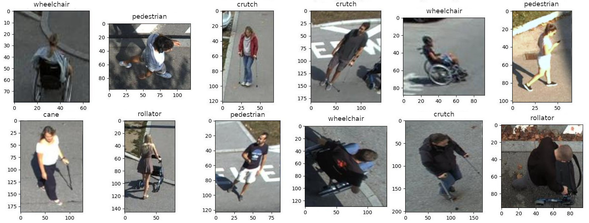

# Human Attribute Classification

> **[BMVC 2023] A Comprehensive Crossroad Camera Dataset of Mobility Aid Users**            
> L. Mohr, N. Kirillova, H. Possegger, H. Bischof\
> Paper

> **[TU Graz] Crossroad Camera Dataset - Mobility Aid Users**\
> L. Mohr, N. Kirillova, H. Possegger, H. Bischof\
> [Dataset](https://repository.tugraz.at/records/2gat1-pev27)
 


## Data Preprocessing
+ Configuration file: `config/opt.py`
+ Image patch extraction using yolo bounding box annotations: `data_processing/extract_bboxes.py`
+ Label visualization of extracted patches: `vis_extracted_patches.py`
+ Bounding box visualization on dataset frames (yolo format): `vis_yolo_labels.py` 

## Training
+ Configuration file: `config/opt.py`
```bash
python main.py 
```

## Testing
+ Configuration file: `config/opt.py`
```bash
python run.py --model <path/to/model.pth> 
              --data <path/to/images>
              --out <path/where/to/save/predictions>
              --vis  # Activate prediction visualization
```

## Evaluation
+ Configuration file: `config/opt.py`
```bash
python evaluate.py --model <model name for title> 
              --gt <path/to/patches/labels.txt>
              --pred <path/to/classifier/predictions.txt>
              --out <path/where/to/save/predictions>
```

##  Citation 
If you use this code in your work or project, please reference:

    @inproceedings{mohr2023mobility
      title={{A Comprehensive Crossroad Camera Dataset of Mobility Aid Users}},
      author={{Mohr, Ludwig and Kirillova, Nadezda and Possegger, Horst and Bischof, Horst}},
      booktitle={{Proceedings of the 34th British Machine Vision Conference ({BMVC})}},
      year={2023}
    }